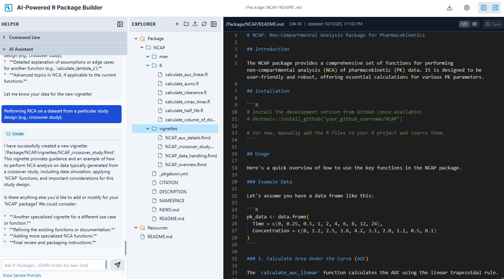

# Example of R Package "NCAP" Created

The following package in NCAP folder was fully created using the app in under 10 minutes. Obviously, it is expected that the developer goes through the output to make sure of accuracy and add whatever else is needed.
