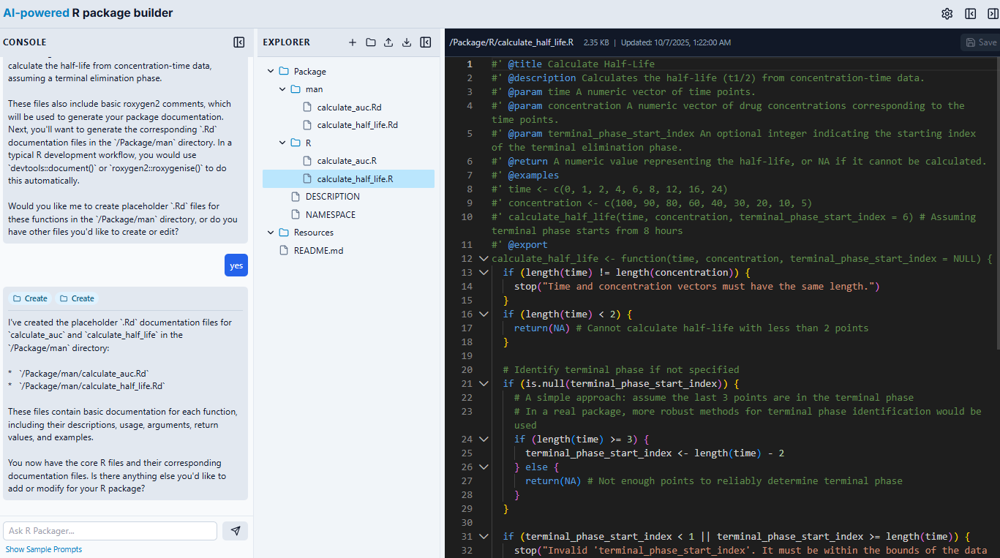

# AI-Powered R Package Builder (www.chat.rpkg.net)



Welcome to the AI-Powered R Package Builder! This is a modern, browser-based Integrated Development Environment (IDE) designed to streamline the creation of R packages. It combines a powerful code editor, a persistent file system, and an integrated AI assistant powered by Google's Gemini API to provide a seamless development experience right in your web browser.

## Features

-   **Professional IDE Layout**: A responsive, multi-panel layout with draggable resizers for a customizable workspace.
-   **Persistent File System**: Your project's file structure and content are saved locally in your browser using IndexedDB, ensuring your work is preserved between sessions.
-   **Full-Featured Code Editor**: Powered by Monaco Editor (the engine behind VS Code), it offers syntax highlighting, autocompletion, and other advanced editing features.
-   **Integrated AI Assistant**: Leverage the power of the Gemini API to generate code, explain concepts, refactor components, and suggest new features.
-   **Complete File Management**: Easily create, rename, duplicate, and delete files and folders within the explorer.
-   **Project Portability**: Download your entire project as a single `.zip` file at any time.
-   **Customizable Settings**: Adjust editor settings like theme (dark/light), font size, word wrap, and minimap visibility.
-   **Offline Functionality**: The application is fully functional offline after the initial load, as the file system is stored locally.

## Tech Stack

-   **Frontend**: React, TypeScript
-   **Styling**: Tailwind CSS
-   **AI Integration**: Google Gemini API (`@google/genai`)
-   **Code Editor**: Monaco Editor (`@monaco-editor/react`)
-   **Local Storage**: IndexedDB for persistent file system
-   **Utilities**: JSZip (for zipping), file-saver (for downloading), lucide-react (for icons)

## How to Use the App

### 1. The Interface

The application is divided into three main sections:

1.  **Left Sidebar (Console & AI)**: Contains the AI Assistant chat and a placeholder Console/Terminal.
2.  **Middle Sidebar (Explorer)**: Displays your project's file and folder structure.
3.  **Main Panel (Editor)**: Where you view and edit your code.

Both sidebars can be closed and resized to focus on your work.

### 2. File Management

-   **Viewing Files**: Click on any file in the **Explorer** to open it in the editor.
-   **Creating Files/Folders**: Use the icons at the top of the Explorer panel to create a new file (`+`), a new folder, or upload a file. New items are created relative to the currently selected item or at the root level.
-   **File Operations**: Hover over a file or folder in the Explorer to reveal icons for renaming, duplicating, and deleting.

### 3. Using the AI Assistant

The AI Assistant is your coding partner. You can find it in the left sidebar.

-   **Ask a Question**: Type any development-related question into the input box and press Enter or click the Send button.
-   **Use Sample Prompts**: Click the `+` icon next to the send button to see a list of pre-written prompts that can help you get started.
-   **Interact with Code**: The assistant can generate code snippets. Use the "Copy" button that appears above a code block to easily copy it to your clipboard and paste it into the editor.

### 4. Saving and Downloading

-   **Saving a File**: After making changes to a file, the "Save" button in the editor's header will become active. Click it to save your changes. The application will warn you if you try to close the browser tab with unsaved changes.
-   **Downloading the Project**: Click the "Download Project" icon in the Explorer's header to package all your files and folders into a single `.zip` file and download it to your computer.

### 5. Settings

-   Click the gear icon (`<SettingsIcon />`) in the top right of the main panel to access the settings page.
-   Here you can configure editor preferences or perform a full reset of the file system to its initial state.

---

## How to Run in Batch with NPM

This application is designed as a client-side, in-browser tool and does not require a build step or a Node.js server to run in its current form. It loads directly from static HTML, CSS, and JavaScript files.

However, if this project were structured as a typical development project using a framework like Create React App or Vite, you would manage it with NPM scripts in your `package.json` file. A hypothetical `package.json` might include the following scripts:

```json
{
  "scripts": {
    "start": "vite",
    "dev": "vite",
    "build": "tsc && vite build",
    "serve": "vite preview",
    "test": "jest"
  }
}
```

-   `npm start`: To run the app in a local development server with hot-reloading.
-   `npm run build`: To bundle the application into static files for production.
-   `npm test`: To run any associated unit or integration tests.

---

## Examples of Results & Usage

Here are some scenarios demonstrating how the AI Assistant can enhance your workflow.

### Example 1: Generate a new R function

You need a function to calculate the area of a circle.

-   **Your Prompt**: `"Write an R function to calculate the area of a circle. It should take the radius as an argument."`
-   **Expected AI Result**: The AI will generate a code block similar to this:

    ```r
    #' Calculate the area of a circle
    #'
    #' @param radius The radius of the circle.
    #' @return The area of the circle.
    #' @examples
    #' circle_area(5)
    circle_area <- function(radius) {
      if (!is.numeric(radius) || radius < 0) {
        stop("Radius must be a non-negative number.")
      }
      return(pi * radius^2)
    }
    ```
-   **Your Action**: Create a new file like `circle_area.R` in the `/Package` folder, copy the code from the AI assistant, and save the file.

### Example 2: Explain existing code

You're unsure what a specific part of the application's own source code does.

-   **Your Prompt**: `"Explain the purpose of the `buildFileTree` function in `utils/fileTree.ts`."`
-   **Expected AI Result**: The AI will provide a detailed, step-by-step explanation:
    > "The `buildFileTree` function is designed to convert a flat array of file system nodes (each with a full path like `/Package/my_func.R`) into a hierarchical tree structure that can be easily rendered in the UI. It does this in two main passes:
    > 1.  It first iterates through all nodes and creates a map where each node is accessible by its unique path.
    > 2.  It then iterates through the map and for each node, it determines its parent's path. It finds the parent in the map and adds the current node to the parent's `children` array.
    > Finally, it sorts the nodes at each level alphabetically, ensuring folders appear before files."

### Example 3: Refactor code for improvement

You want to see if a component can be improved.

-   **Your Prompt**: `"Looking at `components/AIAssistant.tsx`, suggest a way to refactor it to use React hooks more effectively."`
-   **Expected AI Result**: The AI might suggest creating a custom hook to encapsulate the chat logic, making the component cleaner.
    > "The `AIAssistant` component could be refactored by extracting the chat logic into a custom hook, say `useChat`. This hook would manage the `messages`, `isLoading` state, and the `handleSend` function. This would simplify the `AIAssistant` component, making it responsible only for rendering the UI, and improve the reusability and testability of the chat logic."
